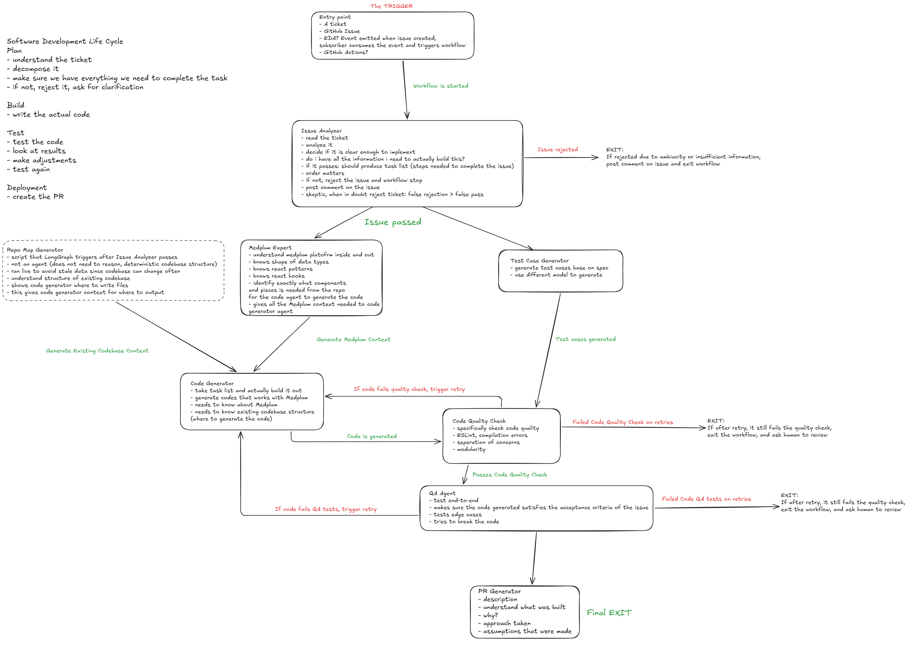

# AI Engineering Harness

An AI engineering harness built to automate the Software Development Life Cycle (SDLC). This project is a multi-agent orchestration system that takes a GitHub issue and autonomously delivers a tested pull request containing implementation code ready for human review.

Currently, the machinery is designed to integrate deeply with the [Medplum Developer Platform](https://github.com/medplum/medplum) and FHIR standards.

## Architecture & Pipeline

The harness is built around a stateful multi-agent workflow powered by [LangGraph](https://www.langchain.com/langgraph). The system operates as a stateful agent graph, where specialized agents progressively build the `HarnessState` through iterative loops and conditional routing.



## Agentic SDLC

The harness mirrors an Agentic SDLC, transforming the traditional software development lifecycle into an autonomous, state-driven process. By moving through these four phases, the system replaces manual hand-offs with agentic transitions:

1. **Plan Phase**: Validate requirements and gather domain context. Handled by the `Issue Analyzer` and `Medplum Expert` agents.
2. **Build Phase**: Generate implementation code and tests.
3. **Test Phase**: Verify code against requirements and quality standards.
4. **Deploy Phase**: Open a pull request for human review.

### Specialized Agents

#### 🟢 Developed

- **Issue Analyzer (`src/agents/issueAnalyzer`)**: The gatekeeper. It reviews incoming GitHub issues for "product clarity". It either decomposes the issue into ordered, actionable subtasks or rejects it with a request for clarification.
- **Medplum Expert (`src/agents/medplumExpert`)**: Provides domain-specific context for Medplum/FHIR. It indexes the SDK and OpenAPI schemas to select exactly the components and resource types needed for a task.

#### 🏗️ Planned / Future

- **Test Case Generator**: Will autonomously generate Vitest test cases based on the issue's acceptance criteria before code is written.
- **Code Generator**: Will consume the task list, Medplum context, and repo map to generate the implementation code.
- **Code Quality Check**: A deterministic script node that runs ESLint, TypeScript compilation, and modularity checks on the generated code. No LLM involved — errors feed directly back to the Code Generator as structured feedback for retry.
- **QA Agent**: Runs the pre-generated test cases against the generated code, validates acceptance criteria, and tests edge cases and error states to try to break the implementation before it reaches a human reviewer.
- **PR Generator**: The final stage that assembles the technical documentation and opens the GitHub Pull Request.

## Tech Stack

- **Language**: TypeScript (Strict Mode)
- **Orchestration**: LangGraph (`@langchain/langgraph`)
- **LLM Integration**: LangChain Core (`@langchain/core`), Anthropic (`@langchain/anthropic`), Google Gemini (`@langchain/google-genai`)
- **Validation**: Zod
- **Testing**: Vitest
- **Environment**: Node.js

## Project Structure

```text
src/
├── agents/             # Modular agent definitions and unit tests
│   ├── issueAnalyzer/      # [🟢 Developed] Requirements reviewer
│   ├── medplumExpert/       # [🟢 Developed] Domain context expert
│   ├── testCaseGenerator/  # [🏗️ Planned] Test case builder
│   ├── codeGenerator/      # [🏗️ Planned] Implementation logic
│   ├── codeQualityCheck/   # [🏗️ Planned] Linter & pattern enforcer
│   ├── qaAgent/            # [🏗️ Planned] E2E validator
│   └── prGenerator/    # [🏗️ Planned] PR documentation author
├── context/            # Generated indexing and tooling for agents
├── graph/              # LangGraph definitions and conditional routing
├── prompts/            # Centralized system prompts for LLMs
├── scripts/            # Build and utility scripts
├── state/              # Shared HarnessState definition and LangGraph annotations
└── utils/              # Shared helper functions (e.g., LLM Factory, Token Counter)
```

## Key Deliverables

- 📐 **Architecture Design**: [docs/ARCHITECTURE_DESIGN_FINAL.pdf](docs/ARCHITECTURE_DESIGN_FINAL.pdf) — The blueprint for the stateful multi-agent system and prompt engineering strategy.
- 📋 **The "Good Ticket" Standard**: [notes/anatomy-of-an-actionable-ticket](notes/anatomy-of-an-actionable-ticket) — The specification for structured, developer-ready issues (see **Section 3.1.1** of the Architecture Design for a deep dive).
- 🧪 **The Drug Interaction Checker Issues (Part of Core Demo)**:
  - [Business Analyst perspective](https://github.com/angelatyk/i-assignment/issues/5)
  - [Tech Lead perspective](https://github.com/angelatyk/i-assignment/issues/4)

## Documentation

- **[notes/development-log.md](notes/development-log.md)**: A changelog capturing key milestones, challenges, and iterative decisions made during development.
- **[notes/notes.md](notes/notes.md)**: Raw technical notes, thought processes, and references (such as GitHub payload examples) used to guide building the system.
- **[notes/issue-101-ba.md](notes/issue-101-ba.md)**: A mock issue written from a Business Analyst's perspective ([Raw JSON](src/mocks/webhooks/ba-drug-interaction.json), based on the work order in the assignment brief). Used to verify the agent's product-clarity gating.
- **[notes/issue-102-tech-lead.md](notes/issue-102-tech-lead.md)**: A mock issue written from a Tech Lead's perspective ([Raw JSON](src/mocks/webhooks/tech-lead-drug-interaction.json), based on the work order in the assignment brief). Used to verify the agent's subtask decomposition with deep technical detail.
- **[notes/issue-103-vague.md](notes/issue-103-vague.md)**: An intentionally vague feature request with undefined criteria ([Raw JSON](src/mocks/webhooks/vague-feature.json)). Used to demonstrate the pipeline's ability to safely reject and request human clarification.
- **[notes/issue-104-complex.md](notes/issue-104-complex.md)**: A multi-faceted feature request ([Raw JSON](src/mocks/webhooks/complex-multi-task.json)). Used to demonstrate the pipeline decomposing a large feature into multiple distinct, ordered subtasks.
- **[docs/ARCHITECTURE_DESIGN_DRAFT.md](docs/ARCHITECTURE_DESIGN_DRAFT.md)**: The original blueprint for the multi-stage AI agent pipeline.

## Videos

- **[Part 1: Scoping the Assignment and Designing the Harness](https://youtu.be/vXDZ9Zny53o)**
- **[Part 2: Environment Setup and MVP Definition](https://youtu.be/mQKbwhBI-a8)**
- **[Part 3: Building the Issue Analyzer Agent](https://youtu.be/fJOm0keTHts)**
- **[Part 4: Evaluating Medplum Context Approaches](https://youtu.be/3wdrCjvpVlw)**
- **[Part 5: Presentation and End-to-End Review](https://youtu.be/DtU9eZ1BHPY)**

## Getting Started

### Prerequisites

- Node.js (v20+)
- npm

### Installation

1. Clone the repository:

   ```bash
   git clone https://github.com/angelatyk/i-assignment.git
   cd ai-engineering-harness
   ```

2. Install dependencies:

   ```bash
   npm install
   ```

3. Environment Setup:
   Copy `.env.example` to `.env` and fill in your API keys (e.g., Anthropic, Google Gemini).
   ```bash
   cp .env.example .env
   ```

### Building Context Indexes

The `medplumExpert` requires localized source and FHIR schema indexes to provide deterministic context generation. You can build these before running the pipeline.

> [!NOTE]
> Pre-generated indexes are already included in `src/context/medplum/indexes/` for convenience. If you wish to rebuild them, ensure you have the Medplum repository cloned locally and use the command below.

```bash
# Build both source and FHIR indexes
npm run build:index
```

### Running the Live Demo

The harness includes an interactive live demo runner designed to trace multiple mock issues (both well-specified and intentionally vague) through the LangGraph pipeline, demonstrating requirements gating and domain context generation.

```bash
# Run the complete multi-agent orchestration demo
npm run demo
```

### Running Tests

We prioritize testing behavior and output contracts. Every agent has a dedicated test suite, and the state graph has full unit test coverage.

```bash
# Run all unit tests
npm run test

# Run tests with coverage
npm run test:coverage

# Run integration checks for individual agents
npm run test:integration:analyzer
npm run test:integration:medplum

# Run end-to-end integration across the entire pipeline
npm run test:e2e
```
